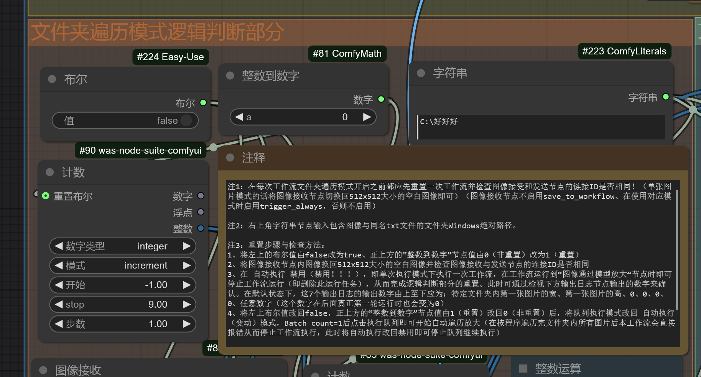

# Automatic-workflows-for-ComfyUI

此为由于不想天天看码，所以突发奇想把后端功能搬前端干的单图片\文件夹自动遍历双模式自动4K分辨率放大脱裤子放屁工作流。在工作流运行完之后，一张大小为1024x1536的图片可以以最小的损耗自动放大3次（前两次放大1.5倍，最后一次放大2倍）到4608x6912（超4k接近6k）的大小。而其中每次放大的倍数与所选取的放大模型与放大方法均可调！

This is a workflow where, out of a desire to avoid looking at code every day, I whimsically moved backend functionality to the frontend to automate the upscaling of single images or entire folders to 4K resolution—essentially, a "Pants off for farting" workflow. After the workflow runs, an image with a size of 1024x1536 can be automatically upscaled three times with minimal loss (the first two times by 1.5x and the last time by 2x) to a size of 4608x6912 (close to 6K, surpassing 4K). The scaling factor and the chosen upscaling model or method for each step are all adjustable!

**工作流导入方法**：将github项目内的automatic upscaling workflow v1.2（by GHOSTLXH）.json文件导入到ComfyUI中或之间把下面这张图像拖入ComfyUI中即可！

Workflow Import Method: Import the `automatic upscaling workflow v1.2 (by GHOSTLXH).json` file from the GitHub project into ComfyUI, or simply drag and drop the image below directly into ComfyUI!

**加注：此放大工作流虽然对文件夹内图像大小的变化做了一些应对措施，可在一定范围内容纳不同分辨率的图像进行遍历自动放大。但当同一文件夹内图像大小差距相差大于等于小图像的50%时会导致工作流逻辑判断出错，导致小图像直接快进到单纯后期模型放大导致工作流出错！因此若遇到这个情况可以使用本项目文件中由今宵（ https://civitai.com/user/TonightXiao_JinXiao ）和银月（ https://civitai.com/user/silvermoong ）提供的 imagebucketmanage 图片分辨率自动分桶脚本来先将需要放大的文件进行分桶（虽然这个脚本原本不是干这个的......），再逐个文件夹进行遍历放大，这样便可完全避免该问题的发生了。**

**Note:** Although this upscaling workflow includes some measures to handle variations in image sizes within a folder, allowing it to process images of different resolutions within a certain range, it may encounter logical errors if the size difference between images in the same folder exceeds 50% of the smaller image's size. This can cause smaller images to skip directly to the post-processing model upscaling stage, leading to workflow failures. To avoid this issue, you can use the `imagebucketmanage` script provided by **Jinxiao** (https://civitai.com/user/TonightXiao_JinXiao) and **Silvermoong** (https://civitai.com/user/silvermoong) from the project files. Although this script was not originally designed for this purpose, it can automatically sort images into resolution-based "buckets." After sorting, you can upscale each folder individually, completely avoiding the aforementioned problem.

1：
**除开新增节点外本工作流还需要的前置节点\节点包（如果还没下载的话建议先使用ComfyManager进行下载）：KJNodes、efficiency-nodes-comfyui、Impact-Pack、Comfyroll_CustiomNodes、was-node-suite-comfyui、Custom-Scripts、ComfyMath、Logic、VideoHelperSuite、Easy-Use、sd-perturbed-attention、**

In addition to the new nodes, this workflow also requires the following prerequisite nodes/node packages (if you haven't downloaded them yet, it is recommended to use ComfyManager to download them first):

**工作流新增的节点包（虽然节点包有6个节点，但在本工作流中只用了5个，你可以发挥你的想象和创造力发明更多其他的用法）：https://github.com/GHOSTLXH/ComfyUI-Counternodes/tree/main**

The workflow introduces a new node package (although the package contains 6 nodes, only 5 are used in this workflow. You can unleash your imagination and creativity to invent other uses for them):

**节点导入方法：将https://github.com/GHOSTLXH/ComfyUI-Counternodes/tree/main 中的6个节点文件夹全部复制黏贴到ComfyUI的Custom_nodes文件夹内即可使用。**

**Node Import Method:** Copy and paste all 6 node folders from [https://github.com/GHOSTLXH/ComfyUI-Counternodes/tree/main](https://github.com/GHOSTLXH/ComfyUI-Counternodes/tree/main) into the `Custom_nodes` folder of ComfyUI to start using them.

**我的lora与其他模型（大爷有空过来玩啊QAQ求求你了求求你了><）：https://civitai.com/user/ghostlxh**

（loras and other models）（Come and have a visit please QAQ）

**工作流整体概览 whole workflow preview**

2：工作流运行前你需要准备的：

2. What You Need to Prepare Before Running the workflow:

**单图片模式：1、你要放大的图片 2、一张大小为512x512的空白png图像**

Single Image Mode:
1. The image you want to upscale.  
2. A blank PNG image with a size of 512x512.

**文件夹遍历模式：1、你要放大的图片 2、与图片同名的，内含该图片对应的正面prompt的txt文本文件 3、一张大小为512x512的空白png图像**

Folder Traversal Mode:
1. The images you want to upscale.  
2. A TXT file with the same name as each image, containing the corresponding positive prompt for that image.  
3. A blank PNG image with a size of 512x512.

**注1：在每次工作流文件夹遍历模式开启之前都应先重置一次工作流并检查图像接受和发送节点的链接ID是否相同！（单张图片模式的话将图像接收节点切换回512x512大小的空白图像即可）**

Note 1:Before starting the folder traversal mode in the workflow each time, you should reset the workflow and check whether the connection IDs of the image receiving and sending nodes are the same! (For single-image mode, simply switch the image receiving node back to a blank 512x512 image.)

3、工作流模式切换方法（**默认为文件夹遍历模式**）：

3. Workflow Mode Switching Method (Default is Folder Traversal Mode):

从文件夹遍历模式切换至单张图片模式：
（1）：将扩散模型加载器的正面提示词输入由上方与Load prompt from TXT节点相连的展示文本节点换回下图节点10的文本输入节点并在其中输入目标图像对应的正面prompt（负面prompt保持不变，如果此模块改为FLUX的话就只用换正面prompt即可）

Switching from Folder Traversal Mode to Single Image Mode:
(1) Change the positive prompt input of the diffusion model loader from the text display node connected to the "Load prompt from TXT" node to the text input node of Node 10 in the image below, and enter the corresponding positive prompt for the target image. (The negative prompt remains unchanged. If this module is replaced with FLUX, only the positive prompt needs to be modified.)

（2）：将图像放大路径判断模块的节点35整数运算节点由原先的，与遍历文件夹逻辑判断模块右下方的节点102 获取图像尺寸数量节点相连改为与单图像放大模式中的节点2的 获取图像尺寸数量节点的宽高相连。

(2) Change the connection of Node 35 (integer operation node) in the image upscaling path judgment module. Instead of connecting it to Node 102 (get image dimensions count node) at the bottom right of the folder traversal logic judgment module, connect it to the width and height of Node 2 (get image dimensions count node) in the single-image upscaling mode.

（3）：将工作流中间已经与右侧的单纯后期模型放大模块中的节点51获取图像尺寸数量节点连接，来自节点71获取图像尺寸数量节点的（文件夹遍历模式）转接点（即下面的转接点）改为使用上方的来自来自节点47获取图像尺寸数量节点的（单张图片放大模式）转接点与单纯后期模型放大模块中的节点51获取图像尺寸数量节点相连接。

(3) Modify the connection point in the middle of the workflow that is currently linked to Node 51 (get image dimensions count node) in the post-processing model upscaling module on the right. Replace the connection from Node 71 (get image dimensions count node) used in folder traversal mode (i.e., the lower connection point) with the upper connection point from Node 47 (get image dimensions count node) used in single-image upscaling mode, and connect it to Node 51 (get image dimensions count node) in the post-processing model upscaling module.

此为未改动（文件夹遍历模式）的连接方法

This is the connection method for the unmodified (folder traversal mode).

此为改动后（单张图片放大模式）的连接方法

This is the connection method after modification (single-image upscaling mode).

**4：重置步骤与启动方法：**

4. Reset Steps and Startup Method:

**单张图片模式：**

**Single Image Mode:**

（1）、将图像接收节点内图像换回512x512大小的空白图像并检查图像接收与发送节点的连接ID是否相同

（2）、检查节点1加载图像节点内加载的图像是否为目标图片

（3）、在节点10与11的文本节点中输入目标图像对应的正面\负面prompt

(1) Replace the image in the image receiving node with a blank 512x512 image and check whether the connection IDs of the image receiving and sending nodes are the same.  

(2) Check whether the image loaded in Node 1 (load image node) is the target image.  

(3) Enter the corresponding positive and negative prompts for the target image in the text nodes of Node 10 and Node 11.

（4）、将队列执行模式改回 自动执行（变动）模式，Batch count=1后点击执行队列即可开始自动放大。

(4) Change the queue execution mode back to **Auto-Execute (On Change)** mode, set `Batch count = 1`, and then click **Execute Queue** to start the automatic upscaling process.

**文件夹遍历模式：**

**Folder Traversal Mode:**

（1）、将左上的布尔值由false改为true、正上方的“整数到数字”节点值由0（非重置）改为1（重置）

（2）、将图像接收节点内图像换回512x512大小的空白图像并检查图像接收与发送节点的连接ID是否相同

(1) Change the Boolean value at the top left from `false` to `true`, and modify the value of the "Integer to Number" node directly above from `0` (non-reset) to `1` (reset).  

(2) Replace the image in the image receiving node with a blank 512x512 image and check whether the connection IDs of the image receiving and sending nodes are the same.

（3）、在上图右上角的节点223字符串节点中输入按格式（以一张图片和与它同名的、包含该图片的正面prompt的txt文件为一个单位）排好图片与txt文件的文件夹绝对路径。（或者也可以分别在该模块的两个加载图像（路径）节点与右侧的Load prompt from TXT节点的路径输入栏内输入）

（4）、在 自动执行 禁用（禁用！！！），即单次执行模式下执行一次工作流，在工作流运行到“图像通过模型放大”节点时即可停止工作流运行（即删除此运行任务），从而完成逻辑判断部分的重置。此时可通过检视下方输出日志节点输出的数字来确认。在默认状态下，这7个输出日志的输出数字由上至下应为：特定文件夹内第一张图片的宽、第一张图片的高、0、0、0、0、任意数字（这个数字在后面真正第一轮运行时也会变为0）

（5）、将左上布尔值改回false，正上方的“整数到数字”节点值由1（重置）改回0（非重置）后，将队列执行模式改回 自动执行（变动）模式，Batch count=1后点击执行队列即可开始自动遍历放大（在按程序遍历完文件夹内所有图片后本工作流会直接报错从而停止工作流执行，此时将自动执行改回禁用即可停止队列继续执行）

(3) In the Node 223 string node at the top right of the image above, input the absolute path of the folder containing the images and their corresponding TXT files (formatted as one unit per image and its associated TXT file with the positive prompt). Alternatively, you can input the paths separately in the two "Load Image (Path)" nodes and the path input field of the "Load prompt from TXT" node on the right.  

(4) With **Auto-Execute** disabled (disabled!!!), i.e., in single-execution mode, run the workflow once. Stop the workflow execution (by deleting the task) when it reaches the "Image Upscaling via Model" node to complete the reset of the logic judgment part. You can confirm this by checking the numbers output by the log nodes below. By default, the output numbers of these 7 log nodes, from top to bottom, should be: width of the first image in the folder, height of the first image, 0, 0, 0, 0, and any number (this number will also change to 0 during the actual first run).  

(5) Change the Boolean value at the top left back to `false`, and modify the value of the "Integer to Number" node directly above from `1` (reset) back to `0` (non-reset). Then, change the queue execution mode back to **Auto-Execute (On Change)** mode, set `Batch count = 1`, and click **Execute Queue** to start the automatic traversal and upscaling process. (After traversing all images in the folder, the workflow will throw an error and stop execution. At this point, disable auto-execution to stop the queue from continuing.)

**注3：此节点的扩散模型辅助放大模块（上图部分）也可更换为flux等其他扩散模型的图生图流程，在图片进行放大前也可连接诸如面部、手部修复工作流，或者是指定第一轮先由flux放大，第二轮再选用其他模型放大（甚至是自回归模型），亦或是将放大工作流改为其他诸如蒙版切换、风格迁移的工作流......而你要做的仅是视情况对各节点的输出轮数进行更改与将遍历模块与对应的工作流连接起来即可，而Alternating output的输出顺序和输入图片数量也可在节点代码层面进行更改，此处仅是抛砖引玉，你可以拿这个遍历模块干很多有趣的事情！！！（前提是你已经充分了解本工作流的工作流程并且做好备份！！！不然出错了跑不动是你自己的问题）**

**Note 3:** The diffusion model-assisted upscaling module (shown in the image above) in this workflow can also be replaced with other diffusion models like FLUX or other image-to-image workflows. Before upscaling, you can connect workflows for facial or hand repair, or specify that the first round of upscaling is done by FLUX and the second round by another model (even autoregressive models). Alternatively, you can modify the upscaling workflow to include tasks like mask switching or style transfer... All you need to do is adjust the output rounds of each node as needed and connect the traversal module to the corresponding workflow. The output order and input image count of the "Alternating output" can also be modified at the node code level. This is just a starting point—you can use this traversal module to do many interesting things! (Provided you fully understand the workflow and have backups ready!!! Otherwise, if it breaks, it's on you.)  

**注4：此工作流调整扩散模型单次放大倍数大小的59与60节点（a）、扩散模型辅助图生图放大目标分辨率的35节点（b）与单次后期模型放大倍数的31与32节点（c）的位置分别如下3图所示，如果需要修改倍数，你所要修改的仅仅是这三处对应节点的乘号（*）后面的数字，那就是你需要修改的倍数，其他的都不用动！**

**Note 4:** In this workflow, the nodes for adjusting the upscaling factors are located as follows:  
- Nodes 59 and 60 (a) for adjusting the single upscaling factor of the diffusion model,  
- Node 35 (b) for setting the target resolution of the diffusion model-assisted image-to-image upscaling,  
- Nodes 31 and 32 (c) for adjusting the single upscaling factor of the post-processing model.  

Their positions are shown in the three images below. If you need to modify the scaling factors, simply change the numbers after the multiplication symbol (`*`) in these nodes. That's all you need to modify—leave everything else untouched!

 （a）

 （b）

 （c）

**5：工作流整体逻辑：**
单张图片模式（单个循环）： 图片加载并获取大小-进行第一次大小对比-输出图片-进行第二次大小对比并决定放大路径（未到目标放大分辨率）-后期模型辅助扩散模型进行i2i放大-回传图片-与原图进行大小对比-输出图片-进行大小对比决定放大路径（未到目标放大分辨率）-后期模型辅助扩散模型进行i2i放大-回传图片-进行大小对比-输出图片-进行大小对比决定放大路径（到达或超过目标放大分辨率）-单纯后期模型放大-保存图像 

**文件夹遍历模式（前3张图片（循环））：**
第一张图片与对应prompt加载并获取大小，同时获取第一张图片的目标放大分辨率-进行大小对比-（单张图片模式的整个循环）-保存第一张图像-加载第二张图片与对应prompt加载并获取大小，同时获取第二张图片的目标放大分辨率-（单张图片模式的整个循环）-保存第二张图像-加载第三张图片与对应prompt加载并获取大小，同时获取第一张图片的目标放大分辨率-（单张图片模式的整个循环）-保存第三张图像-.......-保存最后一张图像-文件夹里已没有图片-工作流报错，强制停止工作流执行

**5. Overall Workflow Logic:**  

**Single Image Mode (Single Loop):**  
1. Load the image and obtain its size.  
2. Perform the first size comparison.  
3. Output the image.  
4. Perform the second size comparison and determine the upscaling path (if the target resolution is not reached).  
5. Use the post-processing model to assist the diffusion model in image-to-image (i2i) upscaling.  
6. Return the upscaled image.  
7. Compare the size with the original image.  
8. Output the image.  
9. Perform another size comparison and determine the upscaling path (if the target resolution is not reached).  
10. Use the post-processing model to assist the diffusion model in i2i upscaling.  
11. Return the upscaled image.  
12. Perform a final size comparison.  
13. Output the image.  
14. Perform a size comparison and determine the upscaling path (if the target resolution is reached or exceeded).  
15. Perform pure post-processing model upscaling.  
16. Save the final image.  

**Folder Traversal Mode (First 3 Images (Loop)):**  
1. Load the first image and its corresponding prompt, obtain its size, and determine the target upscaling resolution.  
2. Perform size comparison.  
3. Execute the entire loop of the single-image mode.  
4. Save the first upscaled image.  
5. Load the second image and its corresponding prompt, obtain its size, and determine the target upscaling resolution.  
6. Execute the entire loop of the single-image mode.  
7. Save the second upscaled image.  
8. Load the third image and its corresponding prompt, obtain its size, and determine the target upscaling resolution.  
9. Execute the entire loop of the single-image mode.  
10. Save the third upscaled image.  
11. Repeat the process until all images are processed.  
12. Save the final image.  
13. When no more images are left in the folder, the workflow will throw an error and forcibly stop execution.

